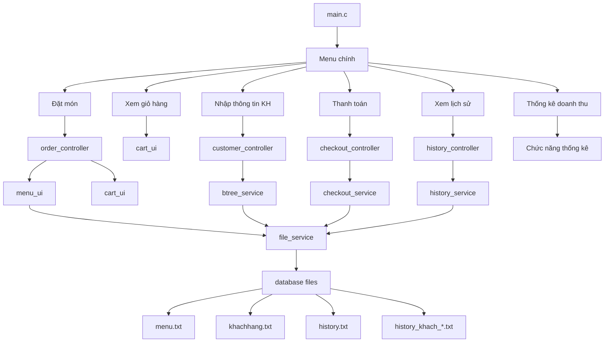

# PBL1 - Hệ Thống Quản Lý Quán Cơm TAM

## Mô tả dự án

Dự án PBL1 là hệ thống quản lý quán cơm TAM được phát triển bằng ngôn ngữ lập trình C. Hệ thống này giúp quản lý menu món ăn, thông tin khách hàng thành viên, đặt món, thanh toán và lưu trữ lịch sử đơn hàng. Dự án sử dụng cấu trúc dữ liệu động như B-Tree cho quản lý khách hàng và lưu trữ file để duy trì dữ liệu.

## Các chức năng chính

- **Quản lý menu**: Hiển thị danh sách món ăn với tồn kho động.
- **Đặt món**: Cho phép khách hàng chọn món với giới hạn 5 món chính.
- **Quản lý khách hàng**: Thêm, tìm kiếm và cập nhật thông tin khách hàng thành viên với hạng và giảm giá.
- **Thanh toán**: Tính toán hóa đơn với ưu đãi thành viên.
- **Lịch sử đơn hàng**: Lưu trữ và xem lịch sử mua hàng của từng khách hàng.
- **Thống kê doanh thu**: Báo cáo tổng quan về doanh thu và số lượng đơn hàng.

## Cấu trúc dự án

Dự án được tổ chức theo kiến trúc MVC (Model-View-Controller) với các thư mục chính:

```
PBL1/
├── main.c                 # File chính, điểm vào của chương trình
├── plan.md                # Kế hoạch phát triển và kiểm tra
├── run.bat                # Script chạy chương trình
├── sualoi.md              # Tài liệu sửa lỗi
├── test.c                 # File test
├── app/
│   ├── controllers/       # Xử lý logic nghiệp vụ
│   │   ├── checkout_controller.c/h    # Xử lý thanh toán
│   │   ├── customer_controller.c/h    # Quản lý khách hàng
│   │   ├── history_controller.c/h     # Xử lý lịch sử
│   │   └── order_controller.c/h       # Xử lý đặt hàng
│   ├── database/          # Lưu trữ dữ liệu
│   │   ├── history.txt                # Lịch sử tổng quát
│   │   ├── history_khach_*.txt        # Lịch sử từng khách hàng
│   │   ├── khachhang.txt              # Thông tin khách hàng
│   │   └── menu.txt                   # Danh sách món ăn
│   ├── models/
│   │   └── models.h                   # Định nghĩa cấu trúc dữ liệu
│   ├── services/          # Logic xử lý dữ liệu
│   │   ├── btree_service.c/h          # Cấu trúc B-Tree cho khách hàng
│   │   ├── checkout_service.c/h       # Dịch vụ thanh toán
│   │   ├── file_service.c/h           # Đọc/ghi file
│   │   └── history_service.c/h        # Dịch vụ lịch sử
│   ├── ui/                # Giao diện người dùng
│   │   ├── bill_ui.c/h                # Hiển thị hóa đơn
│   │   ├── cart_ui.c/h                # Hiển thị giỏ hàng
│   │   ├── history_ui.c/h             # Hiển thị lịch sử
│   │   └── menu_ui.c/h                # Hiển thị menu
│   └── utils/             # Tiện ích
│       ├── helper.c/h                 # Hàm hỗ trợ
│       └── validator.c/h              # Validate đầu vào
└── docs/
    └── idea.md                        # Tài liệu ý tưởng và kiến trúc
```

### Sơ đồ kiến trúc (Mermaid)



## Cách chạy dự án

### Yêu cầu hệ thống
- Hệ điều hành: Windows (do sử dụng batch script)
- Trình biên dịch C: GCC hoặc MinGW
- Không yêu cầu thư viện ngoài (chỉ sử dụng thư viện chuẩn của C)

### Các bước chạy

1. **Clone hoặc tải dự án** về máy tính.

2. **Mở Command Prompt** và điều hướng đến thư mục dự án:
   ```
   cd "d:\VS Code\PBL1"
   ```

3. **Chạy script run.bat**:
   ```
   run.bat
   ```
   Script này sẽ tự động biên dịch tất cả file C và chạy chương trình.

4. **Cách chạy thủ công** (nếu cần):
   - Biên dịch tất cả file .c:
     ```
     gcc -o PBL1 main.c app/controllers/*.c app/services/*.c app/ui/*.c app/utils/*.c
     ```
   - Chạy chương trình:
     ```
     PBL1.exe
     ```

## Cấu trúc dữ liệu chính

### MenuItem
- `id`: Mã món ăn
- `name`: Tên món
- `price`: Giá tiền
- `stock`: Số lượng tồn kho
- `hasOptions`: Có tùy chọn thêm (như sườn cốt lết/cay)

### Customer
- `id`: Mã khách hàng
- `name`: Tên khách hàng
- `phone`: Số điện thoại
- `rank`: Hạng thành viên (Bronze/Silver/Gold)
- `totalSpent`: Tổng tiền đã chi tiêu

### Bill
- `customerId`: Mã khách hàng
- `items`: Danh sách món đã đặt
- `subtotal`: Tổng tiền trước giảm giá
- `discount`: Số tiền giảm giá
- `finalPrice`: Tổng tiền cuối cùng

## Đóng góp

Dự án này là phần của môn học PBL1. Để đóng góp:
1. Tạo issue cho vấn đề cần sửa
2. Tạo pull request với code đã được test
3. Đảm bảo code tuân thủ coding style hiện tại

## Tác giả

- Phát triển bởi sinh viên tham gia môn PBL1

## Giấy phép

Dự án này dành cho mục đích học tập.