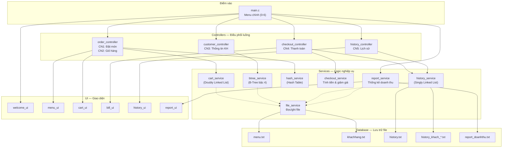

# 🍚 PBL1 — Đặt Món Thông Minh, Tối Ưu Thanh Toán

> **Đồ án PBL1: Lập Trình Tính Toán**  
> Hệ thống quản lý quán cơm tấm được viết hoàn toàn bằng **ngôn ngữ C**, ứng dụng các cấu trúc dữ liệu nâng cao (B-Tree, Hash Table, Doubly Linked List, Singly Linked List) để xử lý nghiệp vụ đặt món, quản lý khách hàng, thanh toán và thống kê doanh thu.

---

## 📋 Mục lục

- [Thông tin đồ án](#-thông-tin-đồ-án)
- [Tính năng chính](#-tính-năng-chính)
- [Cấu trúc dự án](#-cấu-trúc-dự-án)
- [Kiến trúc hệ thống](#-kiến-trúc-hệ-thống)
- [Cấu trúc dữ liệu](#-cấu-trúc-dữ-liệu)
- [Hướng dẫn cài đặt và chạy](#-hướng-dẫn-cài-đặt-và-chạy)
- [Hệ thống hạng thành viên](#-hệ-thống-hạng-thành-viên)
- [Dữ liệu mẫu](#-dữ-liệu-mẫu)

---

## 👨‍🏫 Thông tin đồ án

| | Thông tin |
|---|---|
| **Tên đề tài** | Đặt Món Thông Minh, Tối Ưu Thanh Toán |
| **Môn học** | PBL1 — Lập Trình Tính Toán |
| **GVHD** | PGS. TS. Trương Ngọc Châu |

### Sinh viên thực hiện

| Họ tên | Lớp | MSSV |
|---|---|---|
| Nguyễn Đình Duy Hoàng | 2HT_Nhật 1 | 102250222 |
| Thái Nguyễn Anh Kiệt | 2HT_Nhật 1 | 1022M3343 |

---

## ✨ Tính năng chính

| # | Chức năng | Mô tả |
|---|---|---|
| 1 | **Đặt món** | Hiển thị menu với giá và tồn kho, cho phép chọn món (có tùy chọn phụ như sườn cốt lết / sườn cay), ghi chú và số lượng |
| 2 | **Xem & chỉnh sửa giỏ hàng** | Xem danh sách món đã chọn, xóa món hoặc cập nhật số lượng (Doubly Linked List) |
| 3 | **Nhập thông tin khách hàng** | Đăng ký / tra cứu khách hàng thành viên bằng số điện thoại (B-Tree) |
| 4 | **Thanh toán** | Tính tổng tiền, áp dụng giảm giá theo hạng thành viên, in hóa đơn và cập nhật hạng |
| 5 | **Xem lịch sử đơn hàng** | Tra cứu lịch sử mua hàng theo khách hàng hoặc theo mã hóa đơn (Linked List) |
| 6 | **Thống kê doanh thu & xuất báo cáo** | Tổng hợp doanh thu, số hóa đơn, số món đã bán, phân tích theo từng khách hàng, xuất ra file báo cáo |

---

## 📁 Cấu trúc dự án

Dự án được tổ chức theo kiến trúc **MVC** (Model – View – Controller):

```
PBL1/
├── main.c                          # Điểm vào chương trình, menu chính
├── run.bat                         # Script tự động biên dịch & chạy
├── README.md
│
├── app/
│   ├── models/
│   │   └── models.h                # Định nghĩa tất cả struct & biến toàn cục
│   │
│   ├── controllers/                # Điều phối luồng xử lý (Controller)
│   │   ├── order_controller.c/h    # Luồng đặt món & chỉnh sửa giỏ hàng
│   │   ├── customer_controller.c/h # Luồng nhập thông tin khách hàng
│   │   ├── checkout_controller.c/h # Luồng thanh toán
│   │   └── history_controller.c/h  # Luồng xem lịch sử
│   │
│   ├── services/                   # Logic nghiệp vụ (Model)
│   │   ├── file_service.c/h        # Đọc/ghi file dữ liệu (menu, khách hàng)
│   │   ├── btree_service.c/h       # B-Tree quản lý khách hàng
│   │   ├── hash_service.c/h        # Hash Table tra cứu menu
│   │   ├── cart_service.c/h        # Doubly Linked List quản lý giỏ hàng
│   │   ├── checkout_service.c/h    # Tính tiền, giảm giá, xét hạng
│   │   ├── history_service.c/h     # Linked List lịch sử hóa đơn
│   │   └── report_service.c/h      # Thống kê doanh thu & xuất báo cáo
│   │
│   ├── ui/                         # Giao diện hiển thị (View)
│   │   ├── welcome_ui.c/h          # Màn hình chào mừng (ASCII art)
│   │   ├── menu_ui.c/h             # Hiển thị menu món ăn
│   │   ├── cart_ui.c/h             # Hiển thị giỏ hàng
│   │   ├── bill_ui.c/h             # In hóa đơn
│   │   ├── history_ui.c/h          # Hiển thị lịch sử đơn hàng
│   │   └── report_ui.c/h           # Hiển thị báo cáo doanh thu
│   │
│   ├── utils/                      # Tiện ích dùng chung
│   │   ├── helper.c/h              # Kẻ đường trang trí, lấy ngày giờ
│   │   └── validator.c/h           # Validate đầu vào (int, double, SĐT, ...)
│   │
│   └── database/                   # Dữ liệu lưu trữ (file .txt)
│       ├── menu.txt                # Danh sách 25 món ăn
│       ├── khachhang.txt           # Thông tin khách hàng thành viên
│       ├── history.txt             # Lịch sử hóa đơn tổng hợp
│       ├── history_khach_*.txt     # Lịch sử riêng từng khách hàng
│       └── report_doanhthu.txt     # Báo cáo doanh thu xuất ra
│
└── docs/                           # Tài liệu phát triển
    ├── PLAN.md
    ├── Fix.md
    ├── Fix CN1_CN2.md
    ├── FixChucNang5.md
    ├── ChucNang6.md
    ├── GiaoDien.md
    └── plan_history_details.md
```

---

## 🏗 Kiến trúc hệ thống



---

## 🧠 Cấu trúc dữ liệu

### 1. B-Tree (bậc 4) — Quản lý khách hàng

Dùng để lưu trữ và tra cứu nhanh thông tin khách hàng theo **số điện thoại**.

```c
#define BTREE_ORDER 4
typedef struct BTreeNode {
    Customer* customers[BTREE_ORDER - 1]; // Tối đa 3 khách/node
    struct BTreeNode* children[BTREE_ORDER];
    int numKeys;
    int isLeaf;
} BTreeNode;
```

**Các thao tác:** `createBTreeNode`, `splitChild`, `insertNonFull`, `insertBTree`, `searchBTree`

---

### 2. Hash Table — Tra cứu menu

Bảng băm với **chaining** (danh sách liên kết xử lý đụng độ) để tra cứu món ăn theo ID với độ phức tạp **O(1)**.

```c
#define HASH_TABLE_SIZE 101
typedef struct HashNode {
    int key;
    MenuItem item;
    struct HashNode* next; // Chaining
} HashNode;

typedef struct {
    HashNode **table;
    int size;
} HashTable;
```

**Các thao tác:** `createHashTable`, `hashTableInsert`, `hashTableSearch`, `freeHashTable`

---

### 3. Doubly Linked List — Giỏ hàng

Danh sách liên kết đôi cho phép duyệt **hai chiều**, hỗ trợ thêm/xóa/sửa món trong giỏ hàng linh hoạt.

```c
typedef struct CartNode {
    OrderItem item;
    struct CartNode *prev;
    struct CartNode *next;
} CartNode;

typedef struct {
    CartNode *head;
    CartNode *tail;
    int itemCount;
} Cart;
```

**Các thao tác:** `cartInit`, `cartAddItem`, `cartGetNodeByIndex`, `cartRemoveItemByIndex`, `cartUpdateQuantityByIndex`

---

### 4. Singly Linked List — Lịch sử hóa đơn

Danh sách liên kết đơn lưu toàn bộ lịch sử đơn hàng, hỗ trợ tra cứu theo khách hàng hoặc mã hóa đơn.

```c
typedef struct HistoryNode {
    int customerId;
    Bill bill;
    struct HistoryNode* next;
} HistoryNode;
```

**Các thao tác:** `addBillToHistory`, `getCustomerHistory`, `searchBillById`, `loadHistoryFromFile`, `saveBillToHistoryFile`, `saveBillToGlobalFile`

---

### 5. Các struct nghiệp vụ

| Struct | Mục đích | Trường chính |
|---|---|---|
| `MenuItem` | Món trong menu | `id`, `name`, `price`, `stock`, `hasOptions` |
| `OrderItem` | Món đã đặt | `id`, `name`, `price`, `quantity`, `option`, `note`, `totalPrice` |
| `Customer` | Khách hàng | `id`, `phone`, `name`, `address`, `totalSpent`, `rank` |
| `Bill` | Hóa đơn | `id`, `customer`, `cart`, `total`, `discount`, `finalPrice`, `dateTime` |
| `CustomerRevenue` | Thống kê KH | `customerId`, `billCount`, `revenue` |

---

## 🚀 Hướng dẫn cài đặt và chạy

### Yêu cầu

| Yêu cầu | Chi tiết |
|---|---|
| Hệ điều hành | Windows |
| Trình biên dịch | GCC / MinGW |
| Thư viện | Chỉ dùng thư viện chuẩn C (`stdio.h`, `stdlib.h`, `string.h`, `time.h`) |
| Terminal | Hỗ trợ ANSI escape codes (Windows Terminal, VS Code Terminal) |

### Cách 1 — Dùng script tự động

```bash
git clone https://github.com/nguyendinhduyhoang12345-del/PBL1.git
cd PBL1
run.bat
```

Script `run.bat` sẽ tự động:
1. Biên dịch toàn bộ file `.c` bằng GCC
2. Kiểm tra lỗi biên dịch
3. Chạy chương trình `PBL1.exe`

### Cách 2 — Biên dịch thủ công

```bash
gcc main.c app/services/*.c app/controllers/*.c app/ui/*.c app/utils/*.c -o PBL1.exe
PBL1.exe
```

---

## 🏅 Hệ thống hạng thành viên

Hạng thành viên được tự động cập nhật sau mỗi lần thanh toán, dựa trên **tổng chi tiêu tích lũy**:

| Hạng | Điều kiện | Giảm giá |
|---|---|---|
| 🥉 Bronze | Mặc định (< 500,000đ) | 0% |
| 🥈 Silver | ≥ 500,000đ | 10% |
| 🥇 Gold | ≥ 2,000,000đ | 20% |
| 💎 Diamond | ≥ 50,000,000đ | 30% |

---

## 📦 Dữ liệu mẫu

### Menu (25 món)

Bao gồm các **món chính** (cơm sườn, cơm tấm bì, cơm tấm chả, ...), **món phụ** (bì thịt, chả hấp, lạp xưởng, trứng ốp la, ...), và **đồ uống** (Pepsi, Sting, 7up, nước suối, trà đá).

Dữ liệu menu được lưu trong `app/database/menu.txt` với format:

```
ID|Tên món|Giá|Có tùy chọn (0/1)
```

### Khách hàng mẫu

Hệ thống đi kèm **11 khách hàng mẫu** với đầy đủ thông tin (SĐT, tên, địa chỉ, tổng chi tiêu, hạng). Dữ liệu lưu trong `app/database/khachhang.txt`.

---

## 📄 Giấy phép

Dự án này được phát triển phục vụ mục đích **học tập** trong khuôn khổ môn PBL1 — Trường Đại học Bách khoa, Đại học Đà Nẵng.