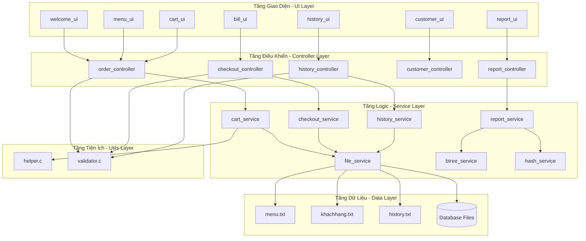
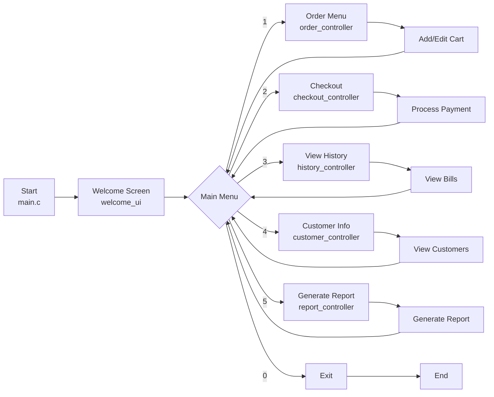
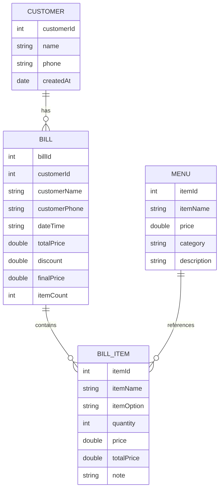

# Sơ Đồ Tổ Chức Chương Trình

## 1. Cấu Trúc Thư Mục

```
PBL1/
├── main.c                          # Điểm vào chính
├── run.bat                         # Script chạy chương trình
├── README.md
│
├── app/                            # Thư mục chính của ứng dụng
│   ├── test.c
│   ├── controllers/                # Điều khiển luồng chương trình
│   │   ├── checkout_controller.c/h
│   │   ├── customer_controller.c/h
│   │   ├── history_controller.c/h
│   │   ├── order_controller.c/h
│   │   └── report_controller.c/h
│   │
│   ├── services/                   # Logic xử lý dữ liệu
│   │   ├── btree_service.c/h       # Cây nhị phân tìm kiếm
│   │   ├── cart_service.c/h        # Quản lý giỏ hàng
│   │   ├── checkout_service.c/h    # Xử lý thanh toán
│   │   ├── file_service.c/h        # Đọc/ghi file
│   │   ├── hash_service.c/h        # Hash table
│   │   ├── history_service.c/h     # Quản lý lịch sử
│   │   └── report_service.c/h      # Tính toán báo cáo
│   │
│   ├── ui/                         # Giao diện người dùng
│   │   ├── bill_ui.c/h             # Hiển thị hóa đơn
│   │   ├── cart_ui.c/h             # Hiển thị giỏ hàng
│   │   ├── customer_ui.c/h         # Hiển thị khách hàng
│   │   ├── history_ui.c/h          # Hiển thị lịch sử
│   │   ├── menu_ui.c/h             # Hiển thị menu món ăn
│   │   ├── report_ui.c/h           # Hiển thị báo cáo
│   │   └── welcome_ui.c/h          # Giao diện chào mừng
│   │
│   ├── models/                     # Định nghĩa cấu trúc dữ liệu
│   │   └── models.h
│   │
│   ├── utils/                      # Hàm tiện ích
│   │   ├── helper.c/h              # Hàm hỗ trợ chung
│   │   └── validator.c/h           # Kiểm tra đầu vào
│   │
│   └── database/                   # Lưu trữ dữ liệu
│       ├── menu.txt                # Dữ liệu menu
│       ├── khachhang.txt           # Dữ liệu khách hàng
│       ├── history.txt             # Lịch sử hóa đơn chung
│       ├── history_khach_*.txt     # Lịch sử từng khách hàng
│       ├── report_doanhthu.txt     # Báo cáo doanh thu
│       └── ...
│
└── docs/                           # Tài liệu dự án
    ├── ARCHITECTURE.md             # File này
    ├── BTree.md
    ├── chucNang1.md - chucNang6.md
    ├── flowchart.md
    └── LUONG_HOAT_DONG_DU_AN.md
```

## 2. Sơ Đồ Kiến Trúc Tầng



## 3. Luồng Chính của Chương Trình



## 4. Quan Hệ Giữa Các Module

| Module | Chức Năng | Phụ Thuộc |
|--------|-----------|----------|
| **order_controller** | Quản lý đặt hàng | cart_service, menu_ui, validator |
| **checkout_controller** | Xử lý thanh toán | checkout_service, bill_ui |
| **history_controller** | Xem lịch sử | history_service, history_ui |
| **customer_controller** | Quản lý khách hàng | btree_service, customer_ui |
| **report_controller** | Báo cáo doanh thu | report_service, report_ui |
| **cart_service** | Logic giỏ hàng | file_service, helper |
| **checkout_service** | Logic thanh toán | file_service, helper |
| **history_service** | Lưu/lấy lịch sử | file_service |
| **report_service** | Tính toán báo cáo | btree_service, hash_service |
| **file_service** | Đọc/ghi file | helper |
| **btree_service** | Cấu trúc dữ liệu B-Tree | - |
| **hash_service** | Hash table | - |

## 5. Cấu Trúc Dữ Liệu Chính



## 6. Quy Trình Xử Lý Dữ Liệu

### Quy Trình Đặt Hàng
```
order_controller
    ↓
menu_ui (hiển thị menu)
    ↓
validator (kiểm tra input)
    ↓
cart_service (thêm vào giỏ)
    ↓
Giỏ hàng (Bill.cart)
```

### Quy Trình Thanh Toán
```
checkout_controller
    ↓
checkout_service (tính toán)
    ↓
file_service (lưu vào history.txt)
    ↓
file_service (lưu vào history_khach_N.txt)
    ↓
bill_ui (hiển thị hóa đơn)
```

### Quy Trình Báo Cáo
```
report_controller
    ↓
report_service (tính toán từ file)
    ↓
btree_service / hash_service (sắp xếp dữ liệu)
    ↓
report_ui (hiển thị + xuất file)
    ↓
report_doanhthu.txt
```
