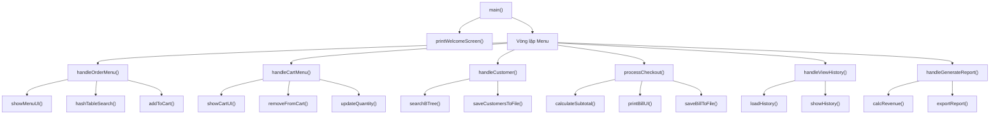

# Sơ Đồ Tổ Chức Chương Trình — Quán Cơm Tấm

## 1. Sơ đồ tổ chức chương trình chính

```mermaid
flowchart TD
    A["main()"]

    A --> B["printWelcomeScreen()"]
    A --> C["Vòng lặp Menu"]

    C --> D["handleOrderMenu()"]
    C --> E["handleCartMenu()"]
    C --> F["handleCustomer()"]
    C --> G["processCheckout()"]
    C --> H["handleViewHistory()"]
    C --> I["handleGenerateReport()"]

    D --> D1["showMenuUI()"]
    D --> D2["hashTableSearch()"]
    D --> D3["addToCart()"]

    E --> E1["showCartUI()"]
    E --> E2["removeFromCart()"]
    E --> E3["updateQuantity()"]

    F --> F1["searchBTree()"]
    F --> F2["saveCustomersToFile()"]

    G --> G1["calculateSubtotal()"]
    G --> G2["printBillUI()"]
    G --> G3["saveBillToFile()"]

    H --> H1["loadHistory()"]
    H --> H2["showHistory()"]

    I --> I1["calcRevenue()"]
    I --> I2["exportReport()"]
```

---

*Hình 22: Sơ đồ tổ chức chương trình Đặt Món — PBL1*
