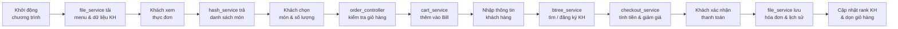

# Quy Trình Tổng Quát Xử Lý Luồng Đặt Món

```mermaid
flowchart LR
    A["Khởi động\nchương trình"] --> B["file_service tải\nmenu & dữ liệu KH"]
    B --> C["Khách xem\nthực đơn"]
    C --> D["hash_service trả\ndanh sách món"]
    D --> E["Khách chọn\nmón & số lượng"]

    E --> F["order_controller\nkiểm tra giỏ hàng"]
    F --> G["cart_service\nthêm vào Bill"]
    G --> H["Nhập thông tin\nkhách hàng"]
    H --> I["btree_service\ntìm / đăng ký KH"]

    I --> J["checkout_service\ntính tiền & giảm giá"]
    J --> K["Khách xác nhận\nthanh toán"]
    K --> L["file_service lưu\nhóa đơn & lịch sử"]
    L --> M["Cập nhật rank KH\n& dọn giỏ hàng"]
```

---

*Hệ Thống Quản Lý Quán Cơm Tấm — PBL1*
